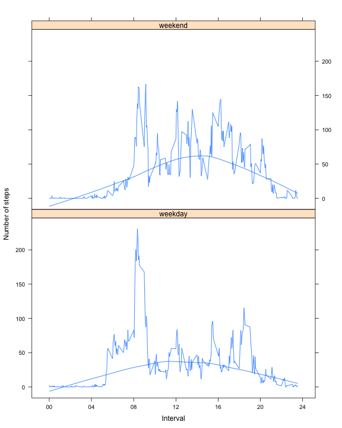

Peer Assessment 1
========================================================

This assignment uses data from the "quantified self" movement, making use of 
data from a personal activity monitoring device. The data consist of two months 
from an anonymous individual collected during the months of October and 
November, 2012 and include the number of steps taken in 5-minute intervals each 
day.

Data
-------------------------------------------------------

The data for this assignment can be downloaded from the course web site as a 
zipped .csv.


```r
fileUrl <- "https://d396qusza40orc.cloudfront.net/repdata%2Fdata%2Factivity.zip"
date()
```

```
## [1] "Sun Aug 17 13:45:55 2014"
```

```r
download.file(fileUrl, destfile = "repdata_data_activity.zip", method = "curl")
unzip("repdata_data_activity.zip")
file <- list.files(pattern="*.csv")
data <- read.csv(file)
```

The variables included in this dataset are:
- **steps**: Number of steps taken in a 5-minute interval (missing values are coded as NA)
- **date**: The date on which the measurement was taken in YYYY-MM-DD format
- **interval**: Identifier for the 5-minute interval in which measurement was taken

There are a total of 17568 observations in this dataset.


```r
head(data)
```

```
##   steps       date interval
## 1    NA 2012-10-01        0
## 2    NA 2012-10-01        5
## 3    NA 2012-10-01       10
## 4    NA 2012-10-01       15
## 5    NA 2012-10-01       20
## 6    NA 2012-10-01       25
```

```r
summary(data)
```

```
##      steps               date          interval   
##  Min.   :  0.0   2012-10-01:  288   Min.   :   0  
##  1st Qu.:  0.0   2012-10-02:  288   1st Qu.: 589  
##  Median :  0.0   2012-10-03:  288   Median :1178  
##  Mean   : 37.4   2012-10-04:  288   Mean   :1178  
##  3rd Qu.: 12.0   2012-10-05:  288   3rd Qu.:1766  
##  Max.   :806.0   2012-10-06:  288   Max.   :2355  
##  NA's   :2304    (Other)   :15840
```

Mean total number of steps per day
-------------------------------------------------------

Ignoring the missing values, we can look at the frequency distribution of the 
number of steps taken each day:


```r
stepsPerDay <- aggregate(data$steps, by=list(Date=data$date), FUN=sum, na.rm=T)
hist(stepsPerDay$x, xlab="Steps/Day", main="", breaks=10)
```

 

The mean is 

```r
meanStepsPerDay <- mean(stepsPerDay$x, na.rm=TRUE)
meanStepsPerDay
```

```
## [1] 9354
```
and the median is 

```r
medianStepsPerDay <- median(stepsPerDay$x, na.rm=TRUE)
medianStepsPerDay
```

```
## [1] 10395
```


Average daily activity pattern
-------------------------------------------------------

Still ignoring missing values, let's look at a time-series plot of the 5-minute intervals and average number of steps taken, averaged across all days:


```r
avgByInterval <- aggregate(data$steps, by=list(data$interval), FUN=mean, na.rm=T)
colnames(avgByInterval) <- c("interval", "avgSteps")

library(lattice)
xyplot(avgSteps~interval, data=avgByInterval, 
	xlab="Interval", ylab="Number of steps", type=c("l","smooth"),
       scales=list(x=list(
      		at=seq(0,2400,400),
      		labels=c("00","04","08","12","16","20","24") )
    	)
       )
```

 

```r
maxAvg <- max(avgByInterval$avgSteps)
```
The maximum (`maxAvg`) of 206.1698 occurs during the five-minute interval 
beginning at the following time:

```r
format(strptime(
	sprintf("%04d", avgByInterval[(avgByInterval$avgSteps==maxAvg),"interval"]), 
	"%H%M"), "%H:%M")
```

```
## [1] "08:35"
```

Imputing Missing Values
-------------------------------------------------------

The number of intervals with missing values is given by 

```r
nrow(data[is.na(data$steps),]) 
```

```
## [1] 2304
```

Missing values may introduce bias into some calculations or summaries of the 
data. Therefore, for each of the missing values, we will substitute the mean 
for that 5-minute interval by merging the average values per interval
into the dataset.


```r
imputed <- merge(data, avgByInterval, by="interval")
imputed$steps[is.na(imputed$steps)] <- imputed[is.na(imputed$steps),"avgSteps"]
```


```r
stepsPerDayImputed <- aggregate(imputed$steps, by=list(imputed$date), FUN=sum, na.rm=T)
hist(stepsPerDayImputed$x, xlab="Steps/Day", main="", breaks=10)
```

 

The new mean is 

```r
meanStepsPerDayImputed <- mean(stepsPerDayImputed$x)
meanStepsPerDayImputed
```

```
## [1] 10766
```
which is 1.1509 times the mean 
without imputed averages, and the new median is 

```r
medianStepsPerDayImputed <- median(stepsPerDayImputed$x)
medianStepsPerDayImputed
```

```
## [1] 10766
```
which is 1.0357 times the median 
without imputed averages.

The imputation of values shifts the overall values slightly upward.

Differences in activity patterns between weekdays and weekends
-------------------------------------------------------

When we look at the differences in activity between weekdays and weekends,
we can see that on weekdays there is a period of strenous excercise around 
8:30am followed by sporadic activity throughout the day. On weekends, 
the morning excercise is less intense, but the amount of activity through the 
day is greater.


```r
## Mark each day as weekday or weekend
imputed$daytype <- "weekday"
imputed[weekdays(as.Date(imputed$date)) %in% c("Saturday","Sunday"), "daytype"] <- "weekend"

daytypeAvg <- with(imputed, aggregate(steps, by=list(daytype,interval), FUN=mean))
colnames(daytypeAvg) <- c("daytype", "interval", "avgSteps")

xyplot(avgSteps~interval|daytype, data=daytypeAvg, 
	xlab="Interval", ylab="Number of steps", type=c("l","smooth") ,
              scales=list(x=list(
      		at=seq(0,2400,400),
      		labels=c("00","04","08","12","16","20","24") )
    	)
)
```

 

